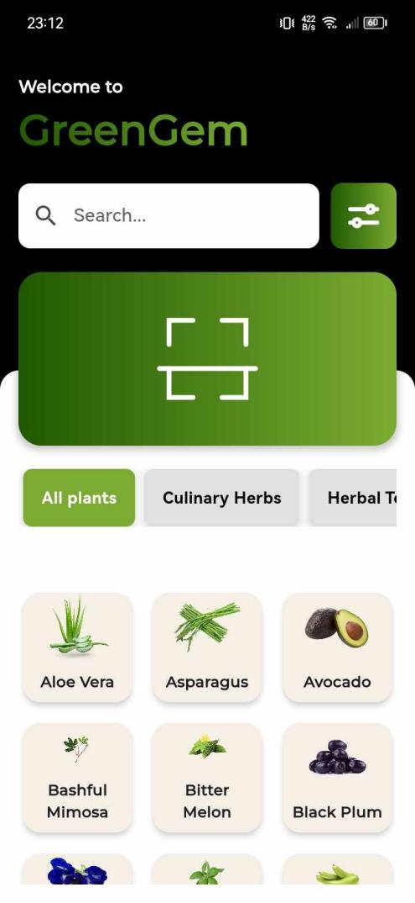
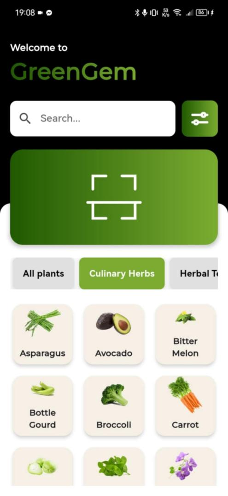
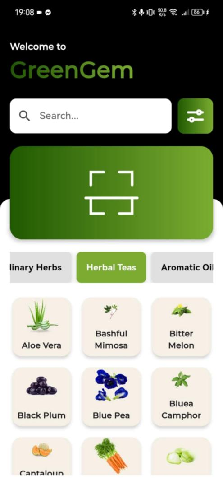
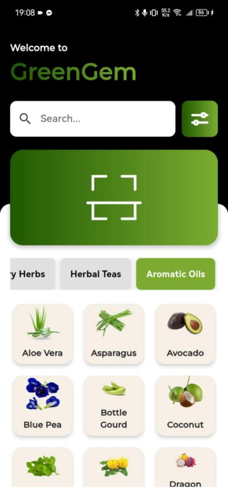

# 🌿 GreenGem

  

  <b>Your Gateway to Herbal Wellness</b>

## 📖 About the Project

GreenGem is a mobile application developed to help users learn about herbal plants commonly found in the Philippines. The application combines educational content with image recognition technology, allowing users to identify plants and explore their medicinal uses, benefits, and preparation methods.

The project was developed as part of a Bachelor of Science in Information Technology (BSIT) capstone project entitled:

**"GreenGem: A Mobile App in Learning Herbal Plants in the Philippines"**

---

## ✨ Features

### 🔍 AI Plant Scanner
- Identify herbal plants using your device camera
- Upload images from your gallery
- Receive instant plant identification results
- Powered by TensorFlow Lite image classification

### 🌱 Herbal Plant Encyclopedia
- Browse detailed plant information
- Learn medicinal uses and benefits
- View preparation methods and descriptions
- Explore scientific and common plant names

### 📂 Plant Categories
- All Plants
- Culinary Herbs
- Herbal Teas
- Aromatic Herbs

### 🔎 Search Functionality
- Quickly find plants using the built-in search bar

### 🌐 Multi-Language Support
- English
- Tagalog

---

## 📸 Application Screenshots

### Welcome Screen

The first screen displayed when launching the application.

---

### Home Screen

The main hub where users can browse plants, search for information, and access the scanner.

---

### Culinary Herbs

Displays herbal plants commonly used in cooking and food preparation.

---

### Herbal Teas

Browse plants commonly used in herbal tea preparations.

---

### Aromatic Herbs

Explore plants used for aromatic oils and fragrances.

---

### Plant Scanner

Capture or upload an image to identify herbal plants using AI-powered image recognition.

---

### Plant Information Module

View detailed plant information including:

- Description
- Scientific Name
- Uses and Benefits
- Preparation Methods

---

### Settings

Configure language preferences and access:

- Terms & Conditions
- Disclaimer
- About the Application

---

## 🤖 Machine Learning Model

GreenGem utilizes a TensorFlow Lite image classification model for real-time plant identification.

### Model Specifications

| Parameter | Value |
|------------|---------|
| Framework | TensorFlow Lite |
| Architecture | MobileNetV2 |
| Plant Classes | 60 |
| Image Size | 224 × 224 |
| Learning Rate | 0.001 |
| Batch Size | 16 |
| Epochs | 50 |

---

## 🛠️ Technologies Used

### Mobile Development
- Flutter
- Dart

### Machine Learning
- TensorFlow
- TensorFlow Lite
- MobileNetV2

### Data Storage
- Hive Database

### Development Tools
- Android Studio
- Visual Studio Code

---

## 📱 User Interface

The application consists of the following modules:

| Module | Description |
|----------|------------|
| Welcome Screen | Initial application screen |
| Home Screen | Main navigation hub |
| Plant Scanner | AI-powered plant recognition |
| Plant Categories | Organized plant browsing |
| Plant Information | Detailed plant descriptions |
| Settings | Language and app information |

---

## 🎯 Objectives

- Promote awareness of herbal plants in the Philippines
- Provide accessible educational resources
- Assist users in identifying medicinal plants
- Encourage learning through modern mobile technology
- Preserve and share traditional herbal knowledge

---

## 🚀 Future Improvements

- Improve model accuracy with larger datasets
- Expand plant database
- Add offline learning modules
- Implement bookmarking and favorites
- Add community plant contributions
- Support additional Philippine languages

---

## 👨‍💻 Project Team

This project was developed by the following BSIT students as part of their capstone project:

| Member | Role |
|----------|----------|
| Dave Matthew L. Maniego | Programmer, UI Designer |
| Ambher Chris V. Narciso | Project Manager, UI Designer |
| AJ T. Miranda | Technical Writer |
| Cris Kim G. Yumul | Technical Writer |

---

## 📄 License

This project was developed for educational and research purposes.

